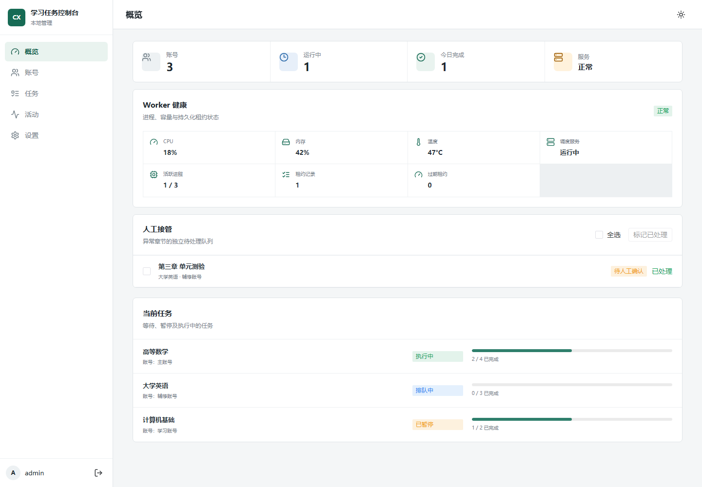
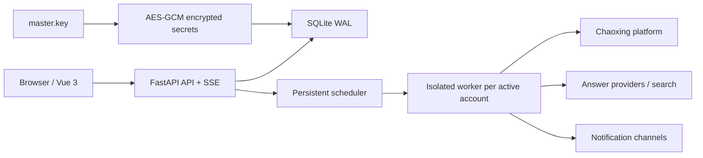

# Chaoxing 学习任务控制台

[](https://github.com/miaodaxia80-droid/chaoxingXXT_Auto-AI-referee/actions/workflows/ci.yml)
[](backend/pyproject.toml)
[](frontend/package.json)
[](LICENSE)

一个面向自托管环境的超星学习任务控制台。项目使用 **FastAPI + Vue 3** 重写控制面，在保留原项目超星协议与任务点处理能力的基础上，提供账号管理、课程与章节发现、持久化任务队列、独立 worker、答案集成、实时事件、通知以及备份恢复。

核心使用路径已经实现并由单元测试、API 集成测试、协议 fixture 和 Playwright 浏览器测试覆盖。

> [!CAUTION]
> 本项目是非官方研究项目，仅可用于管理本人有权访问的账号和学习任务。使用者必须遵守法律法规、学校规定、平台服务条款和学术诚信要求。自动答题或自动提交可能导致错误提交、学习记录异常或账号受限。



*概览、Worker 健康、人工接管与任务进度（演示数据）*

## 功能概览

| 模块 | 主要能力 |
| --- | --- |
| 账号与课程 | 账号 CRUD、UTF-8 CSV 导入、密码/Cookie 登录与回退、课程和章节发现 |
| 学习任务 | 单课程或多课程批量排队、同账号互斥、多账号并行、暂停/恢复/取消、运行时间窗与崩溃恢复 |
| 任务点 | 视频、音频、文档、阅读、空页面和章节测验 |
| 答案能力 | Yanxi、Like、TikuAdapter、OpenAI-compatible、SiliconFlow、答案缓存、多模型并行与 referee |
| 运行观测 | SSE 实时事件、任务进度、worker 健康、系统资源、人工接管审计与事件归档 |
| 通知 | ServerChan、Qmsg、Bark、Telegram 和可重试通知 outbox |
| 数据管理 | Alembic 迁移、受限 legacy 导入、SQLite 快照、数据库与 `master.key` 配对备份/恢复 |
| Web UI | 响应式桌面/移动端界面，浅色、深色与跟随系统主题 |

完整功能边界见 [功能覆盖清单](docs/rewrite/FEATURE_PARITY.md)。

## 架构



- API、调度器和维护任务运行在单个服务实例中。
- 每个活跃账号使用独立 worker 子进程；同一账号通过数据库租约互斥执行。
- fencing token 会阻止过期 worker 继续写入本地状态并降低重复执行风险，但无法撤销已经发出的平台或第三方 HTTP 请求。
- SQLite 使用 WAL、外键、busy timeout、短写事务、账号租约和持久化任务状态。

详细设计见 [架构文档](docs/rewrite/ARCHITECTURE.md)。

## 环境要求

- Python `3.12` 或 `3.13`，项目元数据允许 `>=3.12,<3.15`
- [uv](https://docs.astral.sh/uv/) `0.8.13` 或兼容版本
- Node.js `22`
- pnpm `11.16.0`
- 可选：Docker 与 Docker Compose

## 快速开始

除特别说明外，本文命令均从仓库根目录开始执行。

### Windows 开发模式

克隆仓库：

```powershell
git clone https://github.com/miaodaxia80-droid/chaoxingXXT_Auto-AI-referee.git
Set-Location chaoxingXXT_Auto-AI-referee
```

安装后端依赖、迁移数据库并启动 API：

```powershell
Set-Location backend
uv sync --locked --all-extras --python 3.12
uv run --locked python -m alembic upgrade head
uv run --locked chaoxing-app serve --host 127.0.0.1 --port 5002 --reload
```

另开一个 PowerShell，先切换到刚才克隆的仓库根目录，再启动前端：

```powershell
Set-Location E:\path\to\chaoxingXXT_Auto-AI-referee
Set-Location frontend
corepack enable
corepack prepare pnpm@11.16.0 --activate
pnpm install --frozen-lockfile
pnpm dev
```

访问 <http://127.0.0.1:5173>。Vite 会把 `/api` 代理到 `127.0.0.1:5002`，并保留浏览器侧 Host 以通过后端同源校验；开发数据写入 `backend/data/`。

Linux 和 macOS 的源码开发流程相同，将 PowerShell 的 `Set-Location` 替换为 `cd` 即可。

API 健康检查和交互文档：

- <http://127.0.0.1:5002/api/v1/health>
- <http://127.0.0.1:5002/api/v1/docs>

### 本机 Docker 模式

容器镜像默认使用生产模式，生产会启用 Secure Cookie，不能直接通过 HTTP 登录。若只在本机体验，可以创建 `docker-compose.override.yml`，显式切换为开发模式：

```yaml
services:
  chaoxing:
    environment:
      CX_ENVIRONMENT: development
```

然后启动：

```powershell
docker compose up -d --build
docker compose ps
docker compose logs -f chaoxing
```

访问 <http://127.0.0.1:5002>。Compose 仅绑定宿主机回环地址，并使用独立的 `./chaoxing-data:/app/data` 持久化目录，不会复用旧项目的 `./data`。

> [!WARNING]
> 开发模式会允许浏览器通过 HTTP 回传会话 Cookie，只能用于本机或受信网络，禁止暴露到公网。

## 首次设置

项目没有默认管理员账号或密码。

1. 首次打开控制台，创建至少 3 个字符的管理员名。密码需为 8–256 位，仅可使用英文字母、数字和英文符号，不允许空格。
2. 登录后添加超星账号；密码和 Cookie 至少提供一种。
3. 在“设置”中按需配置答案源、通知、worker 容量、运行时间窗和事件保留周期。
4. 在“任务”中读取课程和章节，选择单门或多门课程后加入队列。

> [!IMPORTANT]
> 尚未创建管理员时，`/api/v1/auth/setup` 是一次性的匿名初始化入口。首次启动必须只绑定本机或受信网络，立即完成管理员创建，再通过 HTTPS 对外开放。

## 生产部署

### Docker Compose

默认 Compose 配置适合放在同机 HTTPS 反向代理之后：

```powershell
docker compose up -d --build
```

为公开域名创建 `docker-compose.override.yml`：

```yaml
services:
  chaoxing:
    environment:
      CX_ALLOWED_ORIGINS: '["https://console.example.com"]'
```

例如使用宿主机 Caddy 终止 TLS：

```caddyfile
console.example.com {
    reverse_proxy 127.0.0.1:5002 {
        flush_interval -1
    }
}
```

生产部署要求：

- 浏览器入口必须是 HTTPS；不要直接把 `5002` 暴露到公网。
- 认证后的修改请求必须通过 CSRF 校验；请求携带 `Origin` 时还必须通过可信来源校验。`setup` 与 `login` 是匿名入口，不依赖 CSRF。
- `CX_ALLOWED_ORIGINS` 必须列出所有实际使用的公开 Origin。
- 反向代理应覆盖客户端提供的转发头，对 SSE 禁用缓冲并配置足够长的读取超时。
- 应用不使用转发头恢复公网客户端地址；经同机反向代理部署时，还应在代理层为登录接口配置面向公网客户端的独立限流。
- 只运行一个 API/调度实例，不要使用多个 Uvicorn worker，也不要让多个副本共享同一 SQLite 数据库。

### 从源码部署

以下命令从仓库根目录开始执行。先构建前端：

```powershell
Push-Location frontend
pnpm install --frozen-lockfile
pnpm build
Pop-Location
```

在 `backend/.env` 中配置生产路径：

```dotenv
CX_ENVIRONMENT=production
CX_DATA_DIR=E:/apps/chaoxing/chaoxing-data
CX_DATABASE_URL=sqlite:///E:/apps/chaoxing/chaoxing-data/chaoxing.db
CX_FRONTEND_DIR=E:/apps/chaoxing/.frontend-dist
CX_ALLOWED_ORIGINS=["https://console.example.com"]
```

迁移并启动：

```powershell
Set-Location backend
uv sync --locked --python 3.12 --no-dev
uv run --env-file .env --locked python -m alembic upgrade head
uv run --env-file .env --locked chaoxing-app serve --host 127.0.0.1 --port 5002
```

Alembic 本身不会通过 Pydantic 自动读取 `.env`，因此生产迁移必须显式传入 `--env-file .env`、设置 `CX_DATABASE_URL`，或使用 `-x database_url=...`。应用在非测试环境中会检查数据库版本，未迁移到当前 head 时拒绝启动。

## 核心配置

所有应用环境变量使用 `CX_` 前缀。常用配置如下：

| 变量 | 默认值 | 说明 |
| --- | --- | --- |
| `CX_ENVIRONMENT` | `development` | `production` 会启用 Secure Cookie |
| `CX_DATA_DIR` | `data` | 数据库主密钥及恢复 journal 的持久化目录 |
| `CX_DATABASE_URL` | `sqlite:///data/chaoxing.db` | SQLAlchemy 数据库 URL |
| `CX_FRONTEND_DIR` | 空 | 已构建的 Vue 静态文件目录 |
| `CX_ALLOWED_ORIGINS` | `[]` | 允许的公开 Origin JSON 数组 |
| `CX_WORKER_MAX_WORKERS` | `2` | 同时活跃的账号 worker 上限 |
| `CX_SESSION_TTL_SECONDS` | `86400` | 管理员会话有效期 |

worker 心跳、租约、恢复和登录限流等配置定义在 [settings.py](backend/src/chaoxing_app/settings.py)。

## 数据与安全

持久化目录包含数据库、SQLite WAL/SHM、`master.key`、恢复 journal 和回滚数据。

- 管理员密码使用 Argon2 哈希。
- 浏览器会话使用服务端存储的不透明 token 和 HttpOnly SameSite Cookie。
- 超星账号、Cookie 和第三方集成凭据使用 AES-GCM 静态加密。
- 静态加密不能抵御数据库与 `master.key` 同时泄露；两者必须一起备份，也必须一起保护。
- 读取 API 仅返回凭据存在标记，不返回密码、Cookie、token 或 API key。
- 结构化事件通过 API 或 SSE 输出前按字段白名单过滤；事件数据库本身仍应按敏感数据保护。

启用第三方集成后会发生数据出站：

- 答案源和模型可能收到题目、选项以及可选的课程上下文。
- DuckDuckGo 搜索查询可能包含课程上下文和题目；搜索限制仅约束长度、结果数、超时和响应大小，不代表查询已匿名化。
- 通知渠道可能收到课程名称、任务 ID 和执行状态。

启用前应审查对应第三方的隐私政策、服务条款和数据保留策略。

## 备份与恢复

备份会使用 SQLite snapshot，并将数据库与匹配的 `master.key` 写入同一个 `.cxbackup` 归档：

以下源码运维示例假定已经按“从源码部署”一节创建 `backend/.env`；若使用默认开发配置且没有 `.env`，请去掉 `--env-file .env`。

```powershell
Set-Location backend
uv run --env-file .env --locked chaoxing-app backup --output ..\backups\chaoxing.cxbackup
```

> [!WARNING]
> `.cxbackup` 实际是未加密 ZIP，敏感级别等同于明文账号凭据。仓库和 Docker 构建上下文会排除 `backups/` 与 `.cxbackup`，但这不能替代访问控制和离线加密存储。

恢复必须在 API 和所有 worker 完全停止时进行：

```powershell
Set-Location backend
uv run --env-file .env --locked chaoxing-app restore --input ..\backups\chaoxing.cxbackup --force
```

`--force` 会先把现有数据库、主密钥和 SQLite sidecar 移入时间戳命名的回滚目录。若失败后 `.restore.lock` 仍存在，应保持服务离线并检查 journal 与对应回滚目录。

容器备份示例：

```powershell
docker compose exec chaoxing chaoxing-app backup --output /app/data/chaoxing-backup.cxbackup
```

备份完成后应尽快移出在线数据卷，存入受访问控制且加密的离线存储。

## 旧版数据导入

根目录旧 `main.py`、`api/`、`web/`、`server.py`、`app.py` 和 `requirements.txt` 仅作为协议与历史行为参考，不属于新应用入口。

受限 legacy importer 默认只执行 dry-run：

以下示例同样假定目标新应用通过 `backend/.env` 配置；执行迁移和导入时必须使用完全相同的目标数据库与数据目录配置。

```powershell
Set-Location backend
uv run --env-file .env --locked python -m alembic upgrade head
uv run --env-file .env --locked chaoxing-app import-legacy --source E:\path\to\chaoxing_web.db
```

核对报告后，在同一个 `backend` 目录中才显式使用 `--apply`：

```powershell
uv run --env-file .env --locked chaoxing-app import-legacy --source E:\path\to\chaoxing_web.db --apply
```

导入器只迁移受支持的账号字段和少量调度设置，不迁移管理员、任务/章节历史、事件、答案缓存或第三方集成配置。源库可能含明文凭据，执行期间必须保持新旧两个应用离线，并确保源库与目标库不是同一文件。

## 开发与测试

后端：

```powershell
Set-Location backend
uv sync --locked --all-extras --python 3.12
uv run --locked python -m pytest -q
uv run --locked python -m ruff check .
uv run --locked python -m mypy
```

前端：

```powershell
Set-Location frontend
pnpm install --frozen-lockfile
pnpm typecheck
pnpm lint
pnpm build
pnpm exec playwright install chromium
pnpm e2e
```

CI 在 Windows/Linux 和 Python 3.12/3.13 上运行后端测试，在 Linux 上执行前端类型检查、lint、构建和 Chromium E2E，并定义 `linux/amd64`、`linux/arm64` 容器构建与健康检查。

## 项目结构

| 路径 | 说明 |
| --- | --- |
| `backend/` | FastAPI、SQLAlchemy、平台协议、worker、Alembic 和后端测试 |
| `frontend/` | Vue 3 控制台和 Playwright E2E |
| `docs/rewrite/` | 架构、功能覆盖与当前验证状态 |
| `Dockerfile` | 新 Web 应用的多阶段容器镜像 |
| `docker-compose.yml` | 单实例部署与持久化卷 |
| 根目录旧代码 | 仅供协议对照和 legacy 导入，不参与新应用运行 |

## 已知限制

- 超星使用非公开且可能变化的页面与接口协议，平台更新、验证码变化或风控策略都可能导致功能失效。
- 当前仅支持一个 API/调度实例，不支持多个 Uvicorn worker 或多个副本共享 SQLite。
- fencing token 不能撤销 worker 已发出的网络请求，因此无法对外部平台副作用提供严格的 exactly-once 保证。
- legacy importer 是有界迁移工具，不是完整历史迁移器。
- CPU、内存和温度指标取决于操作系统能力；不可读取时会明确显示不可用。
- 自动答题、搜索增强和通知会将部分数据发送给所配置的第三方服务。

## 文档

- [架构与安全边界](docs/rewrite/ARCHITECTURE.md)
- [功能覆盖清单](docs/rewrite/FEATURE_PARITY.md)
- [FastAPI OpenAPI 文档](http://127.0.0.1:5002/api/v1/docs)（服务启动后可用）

## 参与贡献

提交 Issue 时请提供脱敏后的日志、复现步骤、运行环境和相关页面/接口变化。禁止提交账号、Cookie、数据库、`master.key`、备份归档、API key、真实题目数据或其他个人信息。

提交代码前请至少运行与改动相关的后端测试、Ruff、mypy、前端类型检查和 ESLint；涉及 UI 流程时同时运行 Playwright。

## 项目来源与致谢

本仓库旧版 Python 脚本基于 [Samueli924/chaoxing](https://github.com/Samueli924/chaoxing) 开发。当前版本在保留相关超星协议与任务点处理基础的同时，重新实现了 Web 控制台、持久化调度、运行隔离和运维能力。感谢原项目作者及所有贡献者。

## 许可证

本项目基于 [GNU General Public License v3.0](LICENSE) 发布。

## 免责声明

本项目与超星学习通及其关联公司无隶属、授权或背书关系，仅用于编程学习、协议研究和管理本人有权访问的学习任务。不得用于绕过付费或访问控制、使用他人账号、出售服务、未授权批量操作或其他违法违规用途。

自动化学习与答题可能产生错误结果、异常学习记录、账号限制或纪律风险。使用者应在启用前理解任务模式、答案来源、覆盖率阈值、自动提交行为和第三方数据流向，并自行承担使用本软件产生的全部风险。
